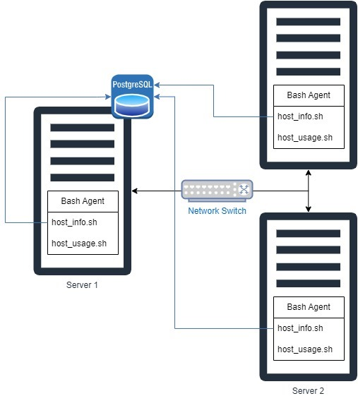

# Introduction 
The Cluster Monitoring Project aims to simplify the process of collecting hardware specifications and resource usage data from Linux servers and then storing it in a PostgreSQL (psql) database.

This project serves developers, system administrators, and DevOps engineers who need to monitor and manage server infrastructure.
By deploying these scripts on their servers, users can automatically collect essential information about their server hardware and ongoing resource usage. This enables better insights into server performance and health, facilitating better monitoring and management of the infrastructure.

The project uses several technologies to achieve its objectives efficiently. Docker to set up a PostgreSQL instance for local development, Git to facilitate version control, collaboration, and track of changes, Bash scripting to create scripts such as psql_docker.sh, host_info.sh and host_usage.sh, and Linux crontab to automate the execution of the host_usage.sh script at regular intervals.

# Quick Start
- Start a psql instance using psql_docker.sh
  ``` ./psql_docker.sh start```


- Create tables using ddl.sql

  ```psql -h localhost -U postgres -f ddl.sql```


- Insert hardware specs data into the DB using host_info.sh
 
    ```./host_info.sh "localhost" 5432 "host_agent" "postgres" "password"```


- Insert hardware usage data into the DB using host_usage.sh

   ```./host_usage.sh "localhost" 5432 "host_agent" "postgres" "password"```


- Crontab setup
  
  ```crontab -e```

# Implementation
To implement the project, start by setting up PostgreSQL with Docker, pulling the image from Docker Hub, and configuring a container. Then, develop two Bash scripts, host_info.sh and host_usage.sh, for collecting hardware information and real-time usage data from each host. Using cron, schedule the host_usage script to run every minute. This data is then collected and stored into the PostgreSQL database where it can be accessed by its users.

## Architecture


## Scripts
Shell script description and usage.

- psql_docker.sh : This shell script is developed to manage a Docker container to run a PostgreSQL database.
``` shell
   #! /bin/sh
   
  # Assign command line arguments to variables
  cmd=$1
  db_username=$2
  db_password=$3
  
  # Check if the Docker service is running; if not, start it
  sudo systemctl status docker || sudo systemctl start docker
  
  # Inspect the Docker container named "jrvs-psql" to check its status
  docker container inspect jrvs-psql
  container_status=$?
  
  # Check the value of the variable "cmd"
  case $cmd in 
    create)
     # Check if the container already exists; if yes, display an error message and exit
      if [ $container_status -eq 0 ]; then
          echo 'Container already exists'
          exit 1  
      fi
  
       # Check if the correct number of arguments is provided for the "create" command
      if [ $# -ne 3 ]; then
        echo 'Create requires username and password'
        exit 1
      fi
  
      # Create a Docker volume named "pgdata"
      docker volume create pgdata
  
      # Run a PostgreSQL Docker container named "jrvs-psql" with specified username, password, and port mapping
      docker run --name jrvs-psql -e POSTGRES_USER=$db_username -e POSTGRES_PASSWORD=$db_password -d -v pgdata:/var/lib/postgresql/data -p 5432:5432 postgres:9.6-alpine
      
      exit $?
      ;;
  
    start|stop)
      # Check if the container exists; if not, display an error message and exit
      if [ $container_status -ne 0 ]; then
        echo "Container does not exist"
        exit 1
      fi
  
      docker container $cmd jrvs-psql
      exit $?
      ;;  
    
    *)
      # Display an error message
      echo 'Illegal command'
      echo 'Commands: start|stop|create'
      exit 1
      ;;
  esac 
 ``` 

- host_info.sh :
  This script collects hardware information from the host system and inserts it into a PostgreSQL database.
``` shell
  #!/bin/bash
  
  # Assign CLI arguments to variables
  psql_host=$1
  psql_port=$2
  db_name=$3
  psql_user=$4
  psql_password=$5
  
  # Check if the correct number of command line arguments is provided
  if [ "$#" -ne 5 ]; then
      echo "Illegal number of parameters"
      exit 1
  fi
  # Obtain the hostname
  hostname=$(hostname -f)
  
  # Extract the number of CPUs
  cpu_number=$(lscpu | egrep "^CPU\(s\):" | awk '{print $2}' | xargs)
  
  # Extract CPU architecture information
  cpu_architecture=$(lscpu | grep 'Architecture' | awk '{print $2}')
  
  # Extract CPU model information
  cpu_model=$(lscpu | grep 'Model name' | sed -r 's/Model name:\s+//')
  
  # Extract CPU clock speed (in MHz)
  cpu_mhz=$(lscpu | grep 'CPU MHz' | awk '{print $3}')
  
  # Extract L2 cache size (in KB)
  l2_cache=$(lscpu | grep 'L2 cache' | awk '{print $3}' | sed 's/K//')
  
  # Retrieve total memory (in MB)
  total_mem=$(vmstat --unit M | tail -1 | awk '{print $4}')
  
  # Get the current timestamp in the format 'YYYY-MM-DD HH:MM:SS'
  timestamp=$(date +"%Y-%m-%d %H:%M:%S")
  
  # SQL INSERT statement to insert hardware information into the PostgreSQL database
  insert_stmt="INSERT INTO host_info (hostname, cpu_number, cpu_architecture, cpu_model, cpu_mhz, l2_cache, total_mem, timestamp) VALUES ('$hostname', '$cpu_number', '$cpu_architecture', '$cpu_model', NULL, '$l2_cache', '$total_mem', '$timestamp')"
  
  # Set the PostgreSQL password as an environment variable
  export PGPASSWORD=$psql_password 
  
  # Execute the SQL INSERT statement
  psql -h $psql_host -p $psql_port -d $db_name -U $psql_user -c "$insert_stmt"
  
  # Print the generated SQL INSERT statement
  echo $insert_stmt
  
  exit $?
```

- host_usage.sh : This script collects usage data from the host system and inserts it into a PostgreSQL database. 

``` shell
  #!/bin/bash

  # Assign CLI arguments to variables
  psql_host=$1
  psql_port=$2
  db_name=$3
  psql_user=$4
  psql_password=$5

  # Check if the correct number of command line arguments is provided
  if [ "$#" -ne 5 ]; then
      echo "Illegal number of parameters"
      exit 1
  fi
  
  # Retrive virtual memory statistics in MB
  vmstat_mb=$(vmstat --unit M)
  
  # Obtain the hostname
  hostname=$(hostname -f)
  
  # Extract the amount of free memory
  memory_free=$(echo "$vmstat_mb" | awk '{print $4}' | tail -n1 | xargs)
  
  # Extract the % of CPU idle time
  cpu_idle=$(echo "$vmstat_mb" | awk '{print $15}' | tail -n1 | xargs)
  
  # Extract the % of CPU time spent in kernel mode
  cpu_kernel=$(echo "$vmstat_mb" | awk '{print $14}' | tail -n1 | xargs)
  
  # Extract the number of disk I/O operations
  disk_io=$(vmstat -d | awk 'NR==3 {print $10}' | xargs)
  
  # Extract the amount of available disk space
  disk_available=$(df -BM / | awk 'NR==2 {print $4}' | sed 's/M//' | xargs)
  
  # Get the current timestamp
  timestamp=$(date +"%Y-%m-%d %H:%M:%S")
  
  # SQL query to find matching id in the host_info table
  host_id="(SELECT id FROM host_info WHERE hostname='$hostname')"
  
  # SQL INSERT statement to insert usage information into the PostgreSQL database
  insert_stmt="INSERT INTO host_usage(timestamp, host_id, memory_free, cpu_idle, cpu_kernel, disk_io, disk_available) VALUES('$timestamp', $host_id, '$memory_free', '$cpu_idle', '$cpu_kernel', '$disk_io', '$disk_available')"
  
  # Set the PostgreSQL password as an environment variable
  export PGPASSWORD=$psql_password 
  
  # Execute the SQL INSERT statement 
  psql -h $psql_host -p $psql_port -d $db_name -U $psql_user -c "$insert_stmt"
  
  exit $?
```
- crontab : Runs ```host_usage.sh``` at regular intervals.
``` shell
# Edit crontab jobs
crontab -e

# List crontab jobs
crontab -

# File location for the script
* * * * * ../linux_sql/scripts/host_usage.sh localhost 5432 host_agent postgres password > /tmp/host_usage.log
```
- queries.sql 
  - Average CPU and Memory Usage : To identify servers with consistently high or low CPU and memory usage.
  ``` 
  SELECT hostname, 
       AVG(cpu_idle) AS avg_cpu_idle, 
       AVG(memory_free) AS avg_memory_free
  FROM host_usage
  GROUP BY hostname;
  ```
    - Monitor Disk Usage :  Lists servers with less than 1GB of available disk space.
  ``` 
  SELECT hostname, 
       disk_available
  FROM host_usage
  WHERE disk_available < 1000;
  ```
  - Retrieve Historical data : Provides historical data for a specific server, useful for trend analysis and capacity planning.
   ```
  SELECT timestamp, 
       cpu_idle, 
       memory_free, 
       disk_io, 
       disk_available
  FROM host_usage
  WHERE hostname = 'your-server-hostname'
  ORDER BY timestamp DESC;
  ```
## Database Modeling

 `host_info` Schema

  | Table     | Column           | Description            | Data Type | Constraints      |
  |-----------|------------------|------------------------|-----------|------------------|
  | host_info | id               | Unique identifier      | SERIAL    | PRIMARY KEY      |
  |           | hostname         | Hostname of the server | VARCHAR   | NOT NULL, UNIQUE |
  |           | cpu_number       | Number of CPU cores    | INT2      | NOT NULL         |
  |           | cpu_architecture | CPU architecture       | VARCHAR   | NOT NULL         |
  |           | cpu_model        | CPU model name         | VARCHAR   | NOT NULL         |
  |           | cpu_mhz          | CPU clock speed in MHz | FLOAT8    | NOT NULL         |
  |           | l2_cache         | L2 cache size in KB    | INT4      | NOT NULL         |
  |           | total_mem        | Total memory in MB     | INT4      |                  |
  |           | timestamp        | Timestamp of insertion | TIMESTAMP |                  |


 `host_usage` Schema

  | Table      | Column         | Description                       | Data Type | Constraints           |
  |------------|----------------|-----------------------------------|-----------|-----------------------|
  | host_usage | host_id        | Foreign key to ```host_info.id``` | SERIAL    | NOT NULL, FOREIGN KEY |
  |            | memory_free    | Free memory in MB                 | INT4      | NOT NULL              |
  |            | cpu_idle       | CPU idle percentage               | INT2      | NOT NULL              |
  |            | cpu_kernel     | CPU kernel usage percentage       | INT2      | NOT NULL              |
  |            | disk_io        | Disk I/O operations               | INT4      | NOT NULL              |
  |            | disk_available | Available disk space in MB        | INT4      | NOT NULL              |
  |            | timestamp      | Timestamp of data collection      | TIMESTAMP |                       |


# Test
To test the DDL (Data Definition Language) scripts, I executed them, against the PostgreSQL instance locally. The ddl.sql script was executed using the psql command-line tool, specifying the appropriate host, user, and database. The result of the test was successfully executed without any errors. The tables were verified to ensure they were created with the expected schema by querying the database.

# Deployment
A docker was installed to set up a PostgreSQL instance. This provided an isolated environment where the application could be developed and tested. The psql_docker.sh script manages the Docker container running the PostgreSQL instance.
Using Linux crontab, the host_usage.sh script is scheduled to collect the data at regular intervals automatically.  This enabled the regular collection and insertion of hardware usage data into the PostgreSQL database without manual intervention.
The bash scripts and SQL files were stored and version-controlled using Git and hosted on GitHub.


# Improvements
- Handle disk usage alerts
- Handle errors 
- Continuous integration
